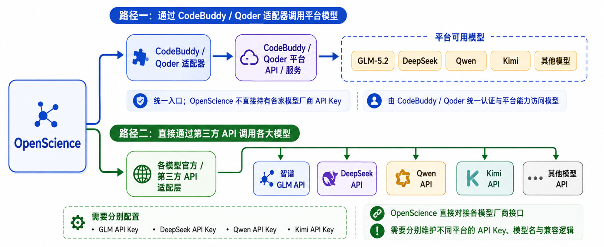

<div align="center">

### 面向科研的开源 AI 工作台（国内模型）

基于 [OpenScience](https://github.com/synthetic-sciences/OpenScience) 的定制分支：内置 **腾讯 CodeBuddy** 与 **Qoder** 作为首选 BYOK 模型提供商，也可用其他主流厂商的自有 API Key。

</div>

---

## 本仓库说明

本项目在上游 OpenScience 能力之上，重点做了国内模型网关适配：

| 提供商 | 说明 | 默认入口 |
| ------ | ---- | -------- |
| **CodeBuddy**（腾讯） | 本分支默认优先展示的 BYOK 目录；兼容流式与工具调用 | `https://www.codebuddy.cn/v2` |
| **Qoder** | Cosy 网关协议适配；支持国内 / 国际区域（**默认国际**；仅配国内密钥或设 `QODER_REGION=cn` 时切国内） | 国内 `gateway.qoder.com.cn` / `openapi.qoder.com.cn`；国际 `api3.qoder.sh` / `openapi.qoder.sh` |

其余能力与上游一致：浏览器工作区、科研 Agent、Skill、科学数据库工具、MCP / 插件扩展等。密钥只保存在本机；请求发往对应提供商（CodeBuddy 为其 HTTP API，Qoder 经其 Cosy 网关）。

---

## 模型接入路径

OpenScience 访问底层大模型有两条独立路径，可按需选用或混用：



| | 路径一：CodeBuddy / Qoder 适配器 | 路径二：直连第三方 API |
| --- | --- | --- |
| **链路** | OpenScience → CodeBuddy/Qoder 适配器 → CodeBuddy/Qoder 平台 API/服务 → 平台可用模型（GLM-5.2、DeepSeek、Qwen、Kimi 等） | OpenScience → 各模型官方/第三方 API 适配层 → 智谱 GLM API、DeepSeek API、Qwen API、Kimi API 等 |
| **密钥管理** | 统一入口；OpenScience 不直接持有各家模型厂商 API Key，由 CodeBuddy / Qoder 统一认证与平台能力访问模型 | 需分别配置 GLM / DeepSeek / Qwen / Kimi 等各自的 API Key |
| **维护成本** | 低：只需维护 CodeBuddy / Qoder 一套密钥 | 较高：OpenScience 直接对接各模型厂商接口，需分别维护不同平台的 API Key、模型名与兼容逻辑 |

本分支默认优先展示路径一（CodeBuddy、Qoder），同时保留路径二以兼容 Anthropic、OpenAI、Google、OpenRouter 等其他厂商的自有 Key（见下文「其他提供商」）。

---

## 功能概览

- **完整科研闭环**：文献、假设、写代码、跑实验、分析与撰写，可在一次会话中连续完成
- **多 Agent**：默认 `research`，另有 `biology` / `physics` / `ml` 专长 Agent，以及 critique、文献综述等子 Agent
- **290+ Skills**：训练、评测、分子与临床生物、化学信息学、论文 / LaTeX、云算力等
- **科学数据库工具**：UniProt、PDB、Ensembl、ChEMBL、PubChem、arXiv、OpenAlex、Semantic Scholar 等
- **浏览器工作区**：文件树、编辑器、终端、会话历史，以及分子 / 结构 / 基因组 / 图表等内联渲染
- **可扩展**：LSP、MCP、插件、自定义 Agent / 命令、TypeScript SDK

---

## 环境要求

- [Bun](https://bun.sh) **1.3+**（本仓库用 Bun 开发与启动）
- 现代浏览器（工作区在本地起服务后于浏览器打开）
- 至少一个模型提供商的 API Key（推荐 CodeBuddy 或 Qoder）

未安装 Bun 时：

```bash
# Windows (PowerShell)
powershell -c "irm bun.sh/install.ps1 | iex"

# macOS / Linux
curl -fsSL https://bun.sh/install | bash
```

---

## 快速开始（从源码）

```bash
# 1. 克隆本仓库
git clone https://github.com/wangyw07/openscience-codebuddy-qoder.git
cd openscience-codebuddy-qoder

# 2. 安装依赖
bun install

# 3. 配置密钥（任选其一，见下文「配置模型」）
# 例如在项目根目录 .env 中写入：
# CODEBUDDY_API_KEY=ck_...
# 或
# QODER_API_KEY=pt-...

# 4. 启动开发态工作区（会打开浏览器）
bun dev
```
---

## 配置模型

密钥可通过以下方式配置（任选）：

- 工作区 **设置 → Models → Provider keys**（模型密钥在此）
- 环境变量，或项目根目录 `.env` / `.env.local`（shell 导出优先于 `.env`）
- CLI（源码态）：`bun --env-file=./.env run --cwd backend/cli --conditions=browser src/index.ts keys add`  
  （若已安装 `openscience` 二进制，则等价于 `openscience keys add`）

### CodeBuddy（腾讯）

| 变量 | 说明 |
| ---- | ---- |
| `CODEBUDDY_API_KEY` | API Key（界面占位形如 `ck_…`） |
| `CODEBUDDY_BASE_URL` | 可选，覆盖默认 Base URL |
| `CODEBUDDY_INTERNET_ENVIRONMENT` | 可选：`public` → `codebuddy.ai`；`ioa` → 腾讯内网 SSO；**默认国内** `codebuddy.cn` |

示例（`.env`）：

```bash
CODEBUDDY_API_KEY=ck_你的密钥
# 默认已是国内节点，一般无需再设
# CODEBUDDY_INTERNET_ENVIRONMENT=public
```

内置模型目录（选择器中可见）：`auto`、`hy3`、`glm-5.2`、`glm-5.1`、`glm-5v-turbo`、`kimi-k3`、`kimi-k2.7`、`kimi-k2.6`、`minimax-m3`、`deepseek-v4-pro`、`deepseek-v4-flash`。

### Qoder

| 变量 | 说明 |
| ---- | ---- |
| `QODER_API_KEY` / `QODER_PAT` / `QODER_PERSONAL_ACCESS_TOKEN` | 国际区密钥（界面占位形如 `pt-…`） |
| `QODERCN_API_KEY` / `QODERCN_PAT` / `QODERCN_PERSONAL_ACCESS_TOKEN` | 国内区密钥；仅配置国内密钥时会自动切到 `cn` |
| `QODER_REGION` / `QODER_BACKEND` / `QODER_MODE` | 可选强制区域：`cn` / `global` |
| `QODER_BASE_URL` | 可选；一般无需修改（内部会改写到 Cosy 网关） |

示例（`.env`）：

```bash
# 国际（默认）
QODER_API_KEY=pt-你的密钥

# 或国内
# QODERCN_API_KEY=pt-你的密钥
# QODER_REGION=cn
```

档位与命名模型包括：`auto`、`ultimate`、`performance`、`efficient`、`lite`、`cantus`、`qwen3.8-max`、`qwen3.7-max`、`qwen3.7-plus`、`kimi-k3`、`kimi-k2.7`、`glm-5.2`、`deepseek-v4-pro`、`deepseek-v4-flash`、`minimax-m3`。

### 其他提供商

仍可使用 Anthropic、OpenAI、Google、OpenRouter、DeepSeek 等；在设置中添加对应 Key，或设置如 `ANTHROPIC_API_KEY`、`OPENAI_API_KEY`、`GEMINI_API_KEY` 等环境变量。

启动后在模型选择器中切换提供商与模型。本分支默认优先展示 **CodeBuddy**、**Qoder** 目录。

---

## 配置文件

| 位置 | 用途 |
| ---- | ---- |
| `~/.config/openscience/openscience.json`（可用 `OPENSCIENCE_CONFIG_DIR` 覆盖） | 全局配置（Linux/macOS 常见路径；Windows 随 XDG 配置目录） |
| `~/.openscience/` | 数据目录（会话、日志、安装的 skills 等；可用 `OPENSCIENCE_DATA_DIR` 覆盖） |
| 项目根 `openscience.json` 或 `.openscience/` | 项目级配置 |
| 项目根 `.env` / `.env.local` | 本地密钥与环境变量（**勿提交到 Git**） |

自定义 Agent、命令、工具、插件、主题可从配置目录加载。Schema 可参考上游：https://openscience.sh/config.json

---

## 目录结构

| 路径 | 内容 |
| ---- | ---- |
| `backend/cli` | CLI、本地服务、Provider（含 CodeBuddy / Qoder）、会话、Skills |
| `frontend/workspace` | 浏览器工作区 UI |
| `frontend/docs` | 文档与会话分享站点 |
| `tooling/sdk/js` | TypeScript SDK |
| `tooling/plugin` | 插件运行时 |

---

## 常用命令

```bash
bun install                          # 安装依赖
bun dev                              # 开发态启动工作区
bun run typecheck                    # 类型检查
bun run --cwd backend/cli test       # 测试
bun run --cwd backend/cli build      # 构建平台二进制
```


