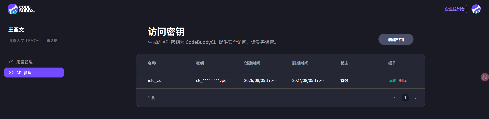
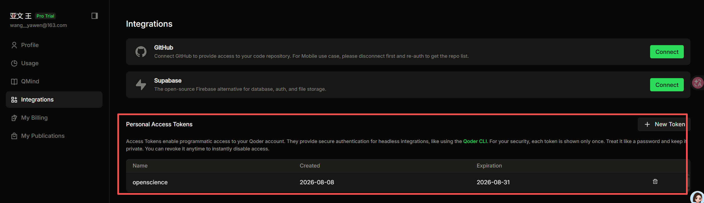
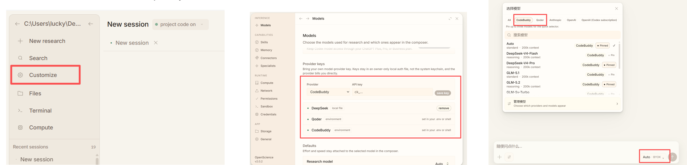

# OpenScience（CodeBuddy / Qoder）使用说明

面向科研的开源 AI 工作台。本分支默认接入 **腾讯 CodeBuddy** 与 **Qoder**，用一套密钥即可使用 GLM、DeepSeek、Qwen、Kimi 等国内常用模型。

默认已有组里腾讯 CodeBuddy与Qoder账号，没有的同学跟张老师或源堃申请。

---

## 第一步：申请 API 密钥

任选其一，也可两个都配。

### 1. CodeBuddy（腾讯）

1. 申请链接：[https://www.codebuddy.cn/profile/keys](https://www.codebuddy.cn/profile/keys)
2. 登录后创建 API Key（形如 `ck_…`）

界面示意：



### 2. Qoder

1. 申请链接：[https://qoder.com/account/integrations](https://qoder.com/account/integrations)
2. 创建 Personal Access Token（形如 `pt-…`）

界面示意：



> **区域说明**：国际密钥用 `QODER_API_KEY`；国内密钥用 `QODERCN_API_KEY`（仅配国内密钥时会自动切到国内节点）。也可手动设置 `QODER_REGION=cn`。

---

## 第二步：克隆并启动项目

```bash
# 1. 克隆仓库
git clone https://github.com/wangyw07/openscience-codebuddy-qoder.git
cd openscience-codebuddy-qoder

# 2. 安装依赖
bun install

# 3. 启动开发态工作区（首次会自动构建前端，并打开浏览器）
bun dev
```

首次启动可能要等一两分钟做前端构建；看到终端里 `Web interface: http://localhost:4096` 后再打开页面。

项目地址：[https://github.com/wangyw07/openscience-codebuddy-qoder](https://github.com/wangyw07/openscience-codebuddy-qoder.git)

---

## 第三步：填入密钥并选择模型

启动后，在工作区中进入：

**设置（Settings）→ Models → Provider keys**

按界面提示填入 CodeBuddy 或 Qoder 的密钥，然后在模型选择器中切换提供商与模型。

界面示意：



### 方式二：用环境变量（可选）

也可在项目根目录创建 `.env`（**勿提交到 Git**）：

```bash
# CodeBuddy
CODEBUDDY_API_KEY=ck_你的密钥

# 或 Qoder（国际，默认）
QODER_API_KEY=pt_你的密钥

# 或 Qoder（国内）
# QODERCN_API_KEY=pt_你的密钥
# QODER_REGION=cn
```

写好后重新执行 `bun dev` 即可。

---

## 可用模型

### CodeBuddy

| 模型 ID | 说明 |
| ------- | ---- |
| `auto` | 自动路由 |
| `hy3` | 混元系列 |
| `glm-5.2` / `glm-5.1` / `glm-5v-turbo` | 智谱 GLM |
| `kimi-k3` / `kimi-k2.7` / `kimi-k2.6` | Kimi |
| `minimax-m3` | MiniMax |
| `deepseek-v4-pro` / `deepseek-v4-flash` | DeepSeek |

### Qoder

| 模型 ID | 说明 |
| ------- | ---- |
| `auto` | 自动路由 |
| `ultimate` / `performance` / `efficient` / `lite` | 档位模型 |
| `cantus` | Cantus |
| `qwen3.8-max` / `qwen3.7-max` / `qwen3.7-plus` | 通义千问 |
| `kimi-k3` / `kimi-k2.7` | Kimi |
| `glm-5.2` | 智谱 GLM |
| `deepseek-v4-pro` / `deepseek-v4-flash` | DeepSeek |
| `minimax-m3` | MiniMax |

本分支默认优先展示 **CodeBuddy**、**Qoder**。如需直连 Anthropic、OpenAI、Google、OpenRouter 等，也可在设置中单独添加对应 Key。

---

## 常见问题

| 问题 | 处理建议 |
| ---- | -------- |
| `bun` 命令找不到 | 确认已安装 Bun，并重新打开终端使 PATH 生效 |
| 打开 `localhost:4096` 显示 **404 Not Found** | 前端未构建。停掉当前进程后重新 `bun dev`；或手动执行 `bun run --cwd frontend/workspace build`，再 `bun run --cwd backend/cli script/generate-web-assets.ts`，然后 `bun dev` |
| 填了 CodeBuddy Key 仍显示 **Authorization Required** | ① Settings → Models → **Managed inference** 选 **Own keys**；② 对话区模型选择器选 **CodeBuddy** 下的模型（如 `GLM-5.2` / `Auto`），不要选其他厂商的同名模型；③ 确认 Key 来自 [codebuddy.cn](https://www.codebuddy.cn/profile/keys)（国内默认节点），保存后 **新建会话** 或重启 `bun dev`；④ 也可在项目根 `.env` 写 `CODEBUDDY_API_KEY=ck_…` 再启动 |
| 启动后无法调用模型 | 检查密钥是否正确、是否已保存；CodeBuddy 一般为 `ck_…`，Qoder 一般为 `pt-…` |
| Qoder 连不上 | 确认国际 / 国内密钥与区域一致；国内可设 `QODER_REGION=cn` |
| 想换模型 | 在工作区顶部的模型选择器中切换提供商与模型即可 |

密钥仅保存在本机；请求发往对应提供商，不会上传到本仓库。

更完整的说明见仓库根目录 [README.md](./README.md)。
